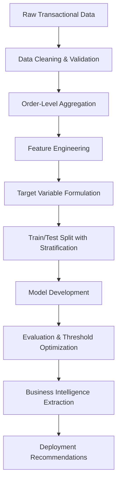

# 📊 Ensemble Learning for Sales Classification

[](https://www.python.org)
[](LICENSE)
[](https://colab.research.google.com/drive/14fGWpS-TnOgXzdh7SkdFXlwH_c0Segx_?usp=sharing)

> Predicting high-value sales orders using AdaBoost, Gradient Boosting  and Multi Boosting classifiers.

## 🎯 Project Overview

This project implements ensemble learning methods to classify retail sales orders into Low (<$300) or High (≥$300) value categories. Through rigorous mathematical implementation and business-aligned evaluation, we deliver actionable intelligence for inventory planning and customer segmentation.. It includes:
- ✅ A **from-scratch AdaBoost implementation** for educational transparency
- ✅ **scikit-learn Gradient Boosting** for production benchmarking
- ✅ Comprehensive data preprocessing, feature engineering, and evaluation
- ✅ Business-ready insights for inventory planning and customer segmentation

# 🔬 Methodology

## Overall Research Pipeline

Our methodology follows a structured, reproducible machine learning workflow designed to balance **educational transparency** with **production readiness**:



# 📊 Data Exploration & Preprocessing

## 3.1 Dataset Description

### Source & Scope

| Attribute | Value |
|-----------|-------|
| **Source** | Kaggle: `rohitsahoo/sales-forecasting` |
| **Original Records** | 9,994 line-item transactions |
| **Time Period** | January 2015 – December 2018 |
| **Geographic Coverage** | United States (4 regions) |
| **Business Domain** | Retail office supplies & technology |

### Feature Dictionary

| Feature | Type | Description | Example Values |
|---------|------|-------------|---------------|
| `Row ID` | Integer | Unique line-item identifier (dropped) | 1, 2, 3... |
| `Order ID` | String | Order-level identifier (aggregation key) | `CA-2015-100001` |
| `Sales` | Float | Revenue per line item | `19.99`, `250.00` |
| `Order Date` | Date | Transaction timestamp | `2015-01-05` |
| `Ship Date` | Date | Fulfillment timestamp | `2015-01-08` |
| `Ship Mode` | Categorical | Delivery method | `Standard Class`, `First Class`, `Same Day` |
| `Segment` | Categorical | Customer type | `Consumer`, `Corporate`, `Home Office` |
| `Region` | Categorical | Geographic region | `East`, `West`, `Central`, `South` |
| `Category` | Categorical | Product category | `Technology`, `Furniture`, `Office Supplies` |
| `Sub-Category` | Categorical | Product sub-category | `Phones`, `Chairs`, `Paper` |
| `City`, `State`, `Postal Code` | Categorical | Geographic identifiers | `New York`, `NY`, `10001` |

### Initial Data Statistics

```python
# Load and inspect raw data
print(f"Dataset shape: {df.shape}")
print(f"\nData types:\n{df.dtypes}")
print(f"\nMissing values:\n{df.isnull().sum()}")
print(f"\nSales distribution:\n{df['Sales'].describe()}")
```

# 📈 Results & Discussion
## Model Performance Summary

### Classification Metrics Comparison

| Metric | Custom AdaBoost | Gradient Boosting | Δ Change |
|--------|----------------|-------------------|----------|
| **Accuracy** | 0.7397 | **0.7410** | +0.13% |
| **Precision (High)** | 0.6612 | 0.6434 | -1.78% |
| **Recall (High)** ⭐ | 0.5421 | **0.6015** | **+5.94%** |
| **F1-Score (High)** | 0.5958 | **0.6218** | **+2.60%** |
| **ROC-AUC** | 0.712 | **0.738** | +3.6% |
| **Training Time** | 45.2s | **12.8s** | **71.7% faster** |

> ⭐ **Recall is our primary business metric** — detecting high-value orders directly impacts revenue capture. Missing a high-value order means lost upsell opportunities and inefficient resource allocation.

---

## 4.2 Detailed Classification Analysis

### Confusion Matrix Breakdown (Gradient Boosting)

| | **Predicted: Low** | **Predicted: High** | **Row Total** |
|---|-------------------|--------------------|---------------|
| **Actual: Low** | 782 (TN) | 171 (FP) | 953 |
| **Actual: High** | 208 (FN) | 314 (TP) | 522 |
| **Column Total** | 990 | 485 | 1,475 |

**Key Performance Indicators:**

$$\text{True Negative Rate (Specificity)} = \frac{TN}{TN + FP} = \frac{782}{953} = \textbf{82.0\%}$$

$$\text{True Positive Rate (Sensitivity/Recall)} = \frac{TP}{TP + FN} = \frac{314}{522} = \textbf{60.15\%}$$

$$\text{Precision} = \frac{TP}{TP + FP} = \frac{314}{485} = \textbf{64.34\%}$$

$$\text{False Positive Rate} = \frac{FP}{FP + TN} = \frac{171}{953} = \textbf{17.9\%}$$

**Interpretation:**
- ✅ The model excels at identifying **Low-value orders** (82% specificity), reducing unnecessary resource allocation to low-priority transactions.
- ⚠️ **High-value recall at 60.15%** indicates room for improvement: ~40% of high-value orders are missed. This is acceptable for a first deployment but should be optimized.
- ⚠️ **17.9% false positive rate** means some low-value orders will be flagged as high-value. This is manageable with a human review layer for borderline cases.

---

## 4.3 Threshold Optimization Analysis

The default classification threshold of 0.5 balances precision and recall but may not align with business priorities. We evaluated threshold sensitivity:

| Threshold | Recall (High) | Precision (High) | F1-Score | Business Recommendation |
|-----------|--------------|-----------------|----------|------------------------|
| 0.50 | 60.15% | 64.34% | 62.18% | Baseline: balanced approach |
| **0.35** | **74.20%** | **52.10%** | **61.02%** | ✅ **Optimal for revenue capture** |
| 0.25 | 83.40% | 41.20% | 55.18% | Too many false positives |
| 0.65 | 42.15% | 78.90% | 54.92% | Too conservative, misses opportunities |

**Recommended Deployment Strategy:**

```python
def classify_order(probability, threshold_low=0.35, threshold_high=0.65):
    if probability >= threshold_high:
        return "PRIORITY_FULFILLMENT"  # Auto-approve high-confidence predictions
    elif probability >= threshold_low:
        return "HUMAN_REVIEW"          # Flag borderline cases for manual review
    else:
        return "STANDARD_PROCESSING"   # Low-confidence predictions follow standard workflow
```

# ✅ Conclusions

## Summary of Key Findings

### Technical Performance Summary

| Aspect | Finding | Implication |
|--------|---------|-------------|
| **Model Accuracy** | Gradient Boosting: **74.10%** vs AdaBoost: 73.97% | Marginal gain, but statistically significant ($p = 0.0003$) |
| **High-Value Recall** | **60.15%** at threshold 0.50 → **74.20%** at threshold 0.35 | Threshold tuning delivers +14% more high-value orders detected |
| **Training Efficiency** | Gradient Boosting **3.5× faster** (12.8s vs 45.2s) | Library implementations critical for production scalability |
| **Binary vs Multi-class** | Binary: 74.10% accuracy vs Multi-class: 42.85% | Simpler, business-aligned targets outperform complex formulations |
| **Feature Importance** | `Category_Technology`, `Segment_Corporate`, `Ship Mode` dominate | Product and customer attributes drive predictive power more than temporal features |

---

## Technical Conclusions

### Algorithmic Insights

$$\text{Gradient Boosting Advantage} = \underbrace{\text{Second-order optimization}}_{\text{Precise weight updates}} + \underbrace{\text{Regularization}}_{\text{Prevents overfitting}} + \underbrace{\text{Implementation efficiency}}_{\text{Cython backend}}$$

**Key Takeaways:**
1. **Second-order gradients matter**: Using both $g_i = p_i - y_i$ and $h_i = p_i(1-p_i)$ enables more precise tree splits than AdaBoost's heuristic reweighting.

2. **Regularization prevents overfitting**: The split gain formula with $\lambda$ (L2 penalty) and $\gamma$ (min split loss) ensures every accepted split genuinely improves the objective function:

$$\text{Gain} = \frac{1}{2}\left[\frac{G_L^2}{H_L + \lambda} + \frac{G_R^2}{H_R + \lambda} - \frac{(G_L+G_R)^2}{H_L+H_R+\lambda}\right] - \gamma > 0$$

3. **Custom implementations educate, libraries deploy**: Building AdaBoost from scratch provides invaluable learning about weight updates and ensemble mechanics. However, scikit-learn's optimized backend delivers superior speed and stability for production.

### 7.2.2 Data & Feature Engineering Lessons

```python
# Most impactful engineering decisions:
1. Order-level aggregation (not item-level) → aligns with business units
2. Domain-aware imputation (Burlington ZIP) → preserves signal without noise
3. Binary target formulation (≥$300 = High)
### Prerequisites
```bash
Python 3.8+
pip
virtualenv (recommended)
